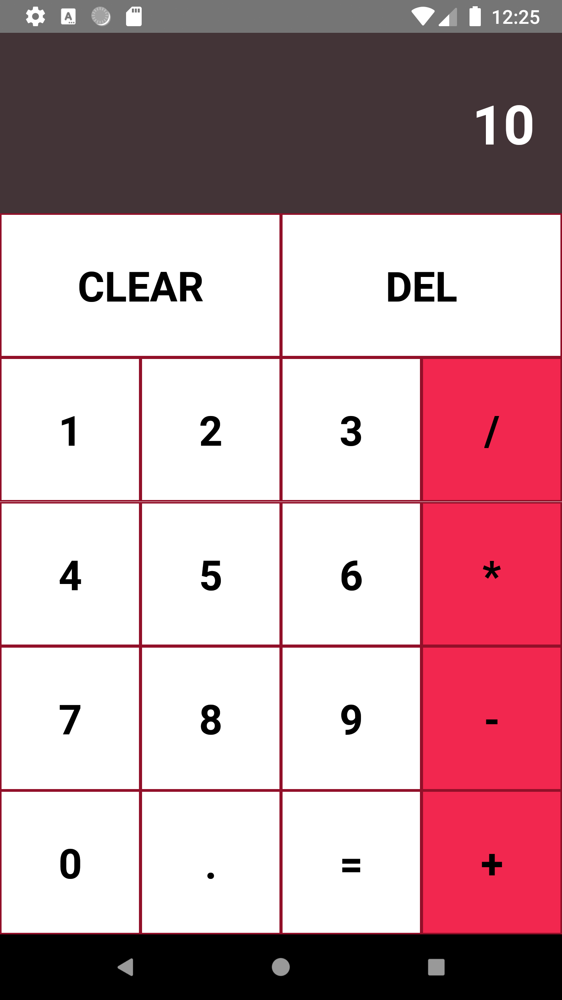
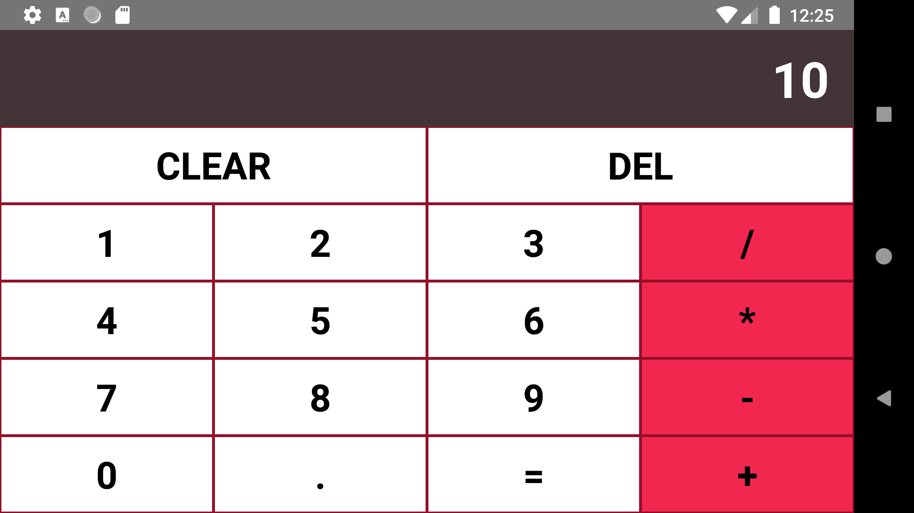

# CalculatorReactNative

Interested in creating a Simple Calculator App using hooks in React Native.

## Getting Started

Checkout this repo, install dependencies, then start the process with the following:

```
> git clone https://github.com/haunguyenphuc1110/CalculatorApp.git
> cd CalculatorApp
> yarn android or yarn ios
> yarn start
```

## UI

<p float="left">
  
   
</p>

## References

- [React](http://www.dropwizard.io/1.0.2/docs/) - The web framework
- [React Native](https://maven.apache.org/) - The mobile framework
- [Typescript](https://rometools.github.io/rome/) - Language used
- [Hooks](https://reactjs.org/docs/hooks-intro.html) - Feature of React
- [Jest](https://jestjs.io/) Use for testing

## Authors

- **Hau Nguyen Phuc** - [haunguyenphuc1110](https://github.com/haunguyenphuc1110)
